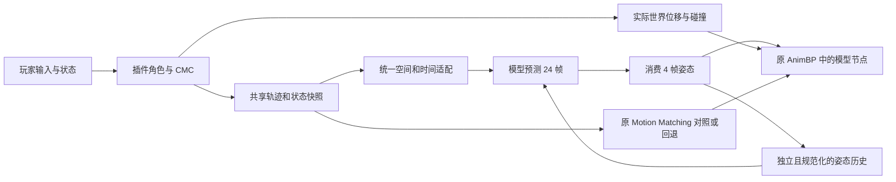

# 训练前复核与下一轮训推方案

> 2026-09-28 架构方向更新：MotionWeaver 定义为基于原版 MotionBricks Tokenizer、Pose 网络和解码器的 UE 玩家模型；本文件第 6 节对 `ReferenceGuidedPose` 的继续训练仅作为轻量基线方案。见 [MotionWeaver 架构对比与迁移计划](../motionweaver-architecture.md)。

| 字段 | 内容 |
| --- | --- |
| 日期 / 执行者 | 2026-09-27，Asia/Hong_Kong；本项目本机代码复核与 CPU 数值检查 |
| 状态 | 复核完成；后续实现与训练为待评审方案，尚未执行 |
| 本轮边界 | 读取导出、数据、训练、Python 推理、UE 实时推理及插件代码；两个现有 ONNX 各做一次 CPU 前向；不更新权重、不启动云 GPU、不修改运行时代码、不提交 |
| 代码基点 | `e07aad29773bf24dcadd98e36271d3af1894e7fe`，dirty；当前工作目录为 `D:/AILocomotonSystem/GR00T-WholeBodyControl-p0-review` |
| 相关未提交实现 | `unreal-script/AIAnimation/Source/AIAnimation/Private/` 中实时推理实现；桥接插件 `unreal-script/AIAnimationMotionMatching/`；既有实验脚本见下文证据 |
| 前序 | [插件角色实跑](2026-09-27-motion-matching-plugin-playable.md)、[接触/速度采样短训](2026-09-27-contact-v2-pilot.md)、[总体计划](../player-state-conditioned-animation-plan.md) |

## 1. 建议决策

**先把同一份输入在 Python 和 UE 中变成同一份动作，再训练模型更好地跟随玩家。** 当前代码存在明确的历史回写差异和模型切换污染，坐标与时间协议也还缺直接验证。此时加大训练量，可能让模型学习补偿运行时错误，无法判断训练有没有帮助。

下一轮顺序：**坐标/历史/时间对齐 → 数据覆盖审计 → 小规模训练对照 → UE 独立回放与手动试玩**。第一阶段完成后，重新测旧权重；改善幅度决定第二阶段的训练优先级。

当前交付目标是平地 Stand 的 Idle、Walk、Run、起步、停步、前进、后退、横移和转向。Crouch 及 Stand↔Crouch 保留为后续现有数据验证项；目前 UE 蹲伏、离地仍由原动画蓝图处理。此次不新增趴下任务，不启动此前暂停的补采。

## 2. 查到了什么

| 项目 | 直接证据 | 对方案的影响 |
| --- | --- | --- |
| 已经有轨迹输入 | `StepModel` 按 CMC 速度、最近移动输入、最大速度、加减速与转向模式构建 24 帧 Root 计划；模型 `forward` 消费 `root_plan` | 不能再把问题概括成“没有获取轨迹”；要验证空间、时间和语义是否一致 |
| 数据空间与角色空间未证明一致 | 导出姿态相对骨架 Root；当前 `GroundRoot` 使用 Actor 旋转；插件 Mesh 相对 Actor 保留 −90°；最终 AnimNode 把骨架 root 设回参考姿态 | 高优先级核验 Actor→Mesh→骨架 Root→模型的完整变换；不可直接再给 Mesh 加减 90° |
| 历史回写确实不同 | Python 把 6D 旋转解码成正交矩阵，下一次从矩阵取两列；UE `AppendHistory` 原样复制网络 6D 输出 | 两边从第二次预测开始就可能输入不同；渲染时归一化并不能修复历史输入 |
| 模型切换共用状态 | 两个模型共用 `PoseHistory`、`RootHistory`、`Generated`、`GeneratedFrame`；`SetDisplayMode` 只改模式 | 之前“先模型 1、再模型 2”的效果不能直接作为权重的独立对比；切换后还可能消费旧模型尚未播放的帧 |
| 显示姿态与内部历史不同 | 显示原 MM 时，模型仍在后台生成并更新自己的历史；重新具备推理条件时使用 Idle seed | 进入模型时未必承接屏幕上当前动作；需要显式暖启动/切换协议 |
| 实时更新周期与训练不同 | UE 每消费 4 帧重新预测；最近短训先生成完整 24 帧，再以 75% 概率用这 24 帧作为下一段历史 | 已有 generated-history 训练，但没有覆盖当前每 4 帧重规划的持续闭环 |
| 时间轴待验证 | 多次补步在同一 Tick 读取同一个当前 Actor；未来计划首帧是当前时刻，数据首帧是历史之后的一帧 | 需记录时间戳并验证是否重复历史或偏一帧；不能仅看到 `30 Hz` 就认为对齐 |
| 状态输入不足 | 现模型输入为历史、Root 计划、未来姿态参考及 mask；没有独立 Stance/Gait/RotationMode 通道 | 后续显式状态模型需要新契约和重训；先解决旧模型可验证的问题 |
| 输出不保证固定骨长 | 79 骨的位置与旋转独立预测，再转成 UE 局部姿态 | FK 约束有价值，但应独立消融，不能与闭环训练一起改导致归因困难 |

源码入口：

- [导出器](../../unreal-script/AILocomotionSystem/AILocomotionDataset/Source/AILocomotionDatasetEditor/Private/AILocomotionDatasetEditorModule.cpp)：`RootTransform`、`GetRelativeTransform(RootTransform)`，约 214–244 行。
- [数据转换](../../data/runtime/unreal_dataset.py)：`convert_root_track`、`convert_clip`，约 269–321 行；[Root 局部化](../../data/runtime/conditioned_motion.py)：`root_local`，约 65 行。
- [模型结构](../../training/pretrain/train_conditioned_pose.py)：`ReferenceGuidedPose`，约 156 行；[Python 旋转解码](../../inference/runtime/conditioned_pose.py)：约 15、60–76 行。
- [最近短训实现](assets/2026-09-27-contact-v2-pilot/train_matched_pilot.py)：约 109–132 行；[Python 4 帧滚动评估](assets/2026-09-25-existing-motion-diagnostics/evaluate_existing_motion.py)。
- [UE 输入与历史](../../unreal-script/AIAnimation/Source/AIAnimation/Private/AIAnimationPlayableTest.cpp)：`Predict`、`AppendHistory`、`TickComponent`、`SetDisplayMode`、`StepModel`，约 267、374、427、456、479 行。
- [Mesh 朝向](../../unreal-script/AIAnimationMotionMatching/Source/AIAnimationMotionMatching/Private/AIAnimationMotionMatchingCharacter.cpp)：约 36 行；[最终姿态节点](../../unreal-script/AIAnimationMotionMatching/Source/AIAnimationMotionMatching/Private/AnimNode_AIAnimationLivePose.cpp)。

**修正前序归因：** 之前记录的约 74° 身体偏航、约 2.15 m/s 低位脚速仍是那次运行的观测；共用历史和坐标协议未排除前，不能据此断言偏航全部来自某个权重。低位脚速是按脚骨高度筛选的代理指标，也不能当成真实接触脚滑率。

## 3. 本次小规模数值复核

仅用于确认差异实际存在，不用于选模型或调参。原数据和权重只读。

| 检查 | 结果 | 能说明什么 |
| --- | --- | --- |
| 训练片段 1299，`Walk_Arc_F_Small_L` | Root 局部 UE 轴速度逐轴中位数约 `(-0.333, 1.972, 0)` m/s | 前向弧线动作主要沿骨架 Root 的 +Y；Actor +X 与训练方向不可直接等同 |
| 训练片段 1313，`Walk_Box_F_LL_Lfoot` | 同口径约 `(1.800, 0, 0)` m/s；身体朝向代理约 91.94° | 来源运动也有朝向与移动方向分离；不能要求所有动作身体都朝速度方向 |
| 训练片段 446，Idle | Root 速度为 0；身体代理约 113.04° | 上身骨点推算朝向会受姿态影响，不宜把它作为绝对朝向真值 |
| control 模型第一批 4 帧 | 原始 6D 与正交化后 6D 的元素绝对差：均值 0.00651，最大 0.04704 | 原样回写与 Python 正交化回写确有数值差异 |
| speed_phase 模型第一批 4 帧 | 同口径均值 0.00618，最大 0.04211 | 同样存在回写差异；并不证明差异造成了多少脚滑/偏航 |

旋转差值无单位，统计为 4×79 个旋转、每个 6 个元素；不是角度误差。输入为同一 24 帧 Idle seed、静止历史 Root、未来每帧 2 m/s 沿模型 Root 的 UE +X 方向匀速前进，时间为 1/30…24/30 秒，未来姿态参考全零。每个模型只调用一次，不是 UE 真实 Tick 回放。

环境：NumPy 2.5.3、ONNX Runtime 1.24.4、CPUExecutionProvider、2 个推理线程，无优化器/训练种子。三条来源均为 train 片段，读取时校验冻结清单 SHA-256。未做全数据方向统计、接触人工复核或本轮 UE 视觉测试。

小型证据：[复核脚本](assets/2026-09-27-pretraining-alignment/probe.py)、[完整数值/样本与模型哈希](assets/2026-09-27-pretraining-alignment/result.json)。执行命令，工作目录为本文所列工作树：

```powershell
& 'D:/AILocomotonSystem/GR00T-WholeBodyControl/.venv/Scripts/python.exe' docs/experiments/assets/2026-09-27-pretraining-alignment/probe.py --bundle output/playable_player_20260927/bundle --contract E:/AIAnimationSystemData/freezes/reference_guided_root_pose_v1_20260924/contract/contract.json --output docs/experiments/assets/2026-09-27-pretraining-alignment/result.json
```

契约 SHA-256：`9bbf2893d461290371c2cefdf54eeb201b09cf639f50ea0dd0254bcc2f9eae9d`。本机原数据 `E:/AIAnimationSystemData/prepared/native30_traversal_semantic_v1`；ONNX/seed/骨架位于工作树 `output/playable_player_20260927/bundle/`。结果 JSON 保存实际 ONNX 和样本哈希；原动作及权重不加入文档资产目录。

## 4. 第一阶段：先让旧模型得到正确、可比较的输入

### 4.1 一份坐标协议

- 写出 World、Actor/胶囊地面原点、Mesh、骨架 Root、模型轴五者的关系，区分点、方向、旋转、厘米/米。
- 定义模型虚拟 Root 在世界中的变换 `T_W_ModelRoot`。当前与未来 Root 均先转到这个空间，再相对最后历史 Root；不能只对位置补 90°，却保留旧朝向四元数。
- 预测姿态的世界变换必须使用与输入对应的 Root 约定；当实际 CMC 与预测 Root 不一致，明确选择重规划/重基准策略，不能悄悄把旧计划下的局部姿态挂到新朝向上。
- 以参考姿态、固定 yaw 0/90/180°、平移和已知来源姿态做往返验证。特别验证完整角色绕世界 Z 旋转 90°后，局部模型输入不变、输出只做整体旋转。
- 保留 Mesh 当前资产朝向；通过契约适配定位修正点，避免再次凭画面改 Mesh 的 ±90°。

### 4.2 同一条时间轴与历史

- 明确最后历史帧为 `t`，未来 24 帧为 `t+1…t+24`；消费 4 帧后，在 `t+4` 重规划。固定 30 Hz 采样与显示帧率分离。
- 从带时间戳的 CMC 缓存重采样 Root，多次补步不能复制同一个时刻；记录输入时间、生成时间、实际显示时间。明确 CMC 更新、模型组件更新、AnimInstance 取快照的先后关系。
- UE 使用与 Python 一致的 6D 正交化/退化处理再回写；归一化、反归一化、参考骨轴及矩阵列顺序全部做一致性核对。
- 每个模型有独立历史、缓冲与推理计数。正式对照使用独立重置的运行，不靠按 1/2/3 连续切换获得比较结果。
- 从原 MM 切到模型时，把当前显示姿态按同一契约转成有效历史并暖启动；消费缓存随 session 切换失效。IK 后姿态若反馈给模型，必须与训练处理一致；不能随意混入历史。
- 第一阶段不添加脚锁等画面修正，以免掩盖模型原始输出差异。后续可独立对比修正前后。

### 4.3 插件成为统一控制来源

保留 `MotionMatchingInCpp` 的角色、Enhanced Input、CMC、原 AnimBP 与 Chooser。Host 副本 C++ 的 `CharacterBase` 已有 Gait、Stance、MovementMode 等状态；本次没有在其 C++ 中找到轨迹生成实现，原动画蓝图中的生成节点和时间偏移仍需核查。

优先把原 MM 使用的轨迹提取为同一份带时间戳快照，同时送给 MM 与模型适配器；若原节点暂时无法共享，先导出两条轨迹逐帧比较，确认差异后再选统一来源。当前手写 CMC 简化外推不等于完整复用了原 MM 的轨迹。

CMC 继续决定实际位移、碰撞与玩家运动状态。模型负责输出匹配该运动的姿态。预测 Root 是计划，实际 CMC Root 是历史和世界脚速计算的依据。



### 4.4 第一阶段交付与准入

- [ ] 一份空间/单位/时间/状态契约和小型可重放输入包。
- [ ] 相同输入的 PyTorch FP32→Python ORT→UE NNE 比较；分别报告张量误差、解码后的骨点误差与旋转角误差。
- [ ] 多步回放逐次比较，包括历史回写，不能只测第一次前向。
- [ ] 旧权重四方向、起停、转向的独立运行结果与蒙皮视频。

建议初始数值准入：输入误差 ≤1e-5（归一化单位）；单次解码后最大骨点差 ≤1 mm、旋转差 ≤0.1°；相同录制 Root 下多步回放无时间错帧。阈值为拟定值，先用等价 CPU 后端校准并在新训练前冻结；它们不代表动画质量合格。

**本阶段无需 GPU 训练。** 若修复后旧权重方向明显改善，先更新根因判断，不能继续沿用“主要是模型”的旧结论。

## 5. 第二阶段：现有数据按真实运动审计

冻结原始 1722 条数据的已有划分，不把诊断表现好的测试动作挪入训练。当前契约窗口共 34733 个，train/validation/test 为 26861/4052/3820；这些是全契约窗口数，不是下一轮 Stand 子集数量。最近 pilot 使用的 938 条长片段子集主要为 Walk/Run/Crouch，不能代表全部数据的状态/方向覆盖。

重新生成训练清单时，统计**有效帧、持续时间、独立动作家族和窗口**，防止长动作及重复窗口主导采样：

| 维度 | 获取方式 | 处理 |
| --- | --- | --- |
| 速度、加速度、角速度 | 配对 Root 与时间戳推导 | 按窗口统计，替代只用整条片段均速 |
| 前后左右、弧线、转向 | 骨架/Root 朝向与速度的相对关系，抽样核对 | 文件名只作提示；横移不能标成“身体必须转过去” |
| Idle/Walk/Run、Start/Loop/Stop | 现有标签结合速度变化审核 | 补足静止、起停；不能只保留长循环片段 |
| 接触 | 真 Root 恢复世界脚位置/速度，足/脚掌联合审计 | 保存置信度；腾空与摆动脚不受锁脚惩罚 |
| Stand/Crouch、玩家意图 | 已有可信姿态标签；纯动画无法还原当时玩家按键 | 缺少的控制意图标 unknown/mask，不伪造实测状态 |

最近 `speed_phase` 的 phase 取自已有语义标签，并非真实连续步态相位；不能把那次试验当成已经检验了步态相位建模。

训练目标必须来自匹配的 Root+姿态：保持同一时间缩放和空间变换。整体世界 yaw 旋转可测试坐标等变性，但不能把向前动作变成横移动作。任意换成另一条未来 Root、继续监督原姿态，会制造矛盾标签。

来源未来 Root 可以作为“与目标动作匹配的期望路径”训练条件。真实玩家推理则只有控制器预测，必须单列评估；来源未来 Root 的成绩不能冒充实时玩家成绩。大幅路径改变要有匹配目标，例如合法重定时或以后录制的教师数据，当前不执行新增录制。

交付：方向×速度×起停×状态覆盖表、接触置信度表、Stand 训练清单及缺口表。缺失方向先报告缺口，不靠重复采样制造覆盖。

## 6. 第三阶段：先做能归因的短训练

### 6.1 先做两组，再决定是否改结构

先用 8–16 条来自 train、方向覆盖已核对的片段做拟合诊断；能否拟合只能证明训练链路可工作，不作为泛化效果。通过后，在相同训练清单、初始化、优化步数、采样顺序、优化器、损失设置下比较：

| 组别 | 变化 | 目的 |
| --- | --- | --- |
| A：配套对照 | 当前 24 帧生成历史训练方式；使用已修复的统一编码/运行时 | 给新数据子集上的公平参照 |
| B：4 帧滚动 | 每次预测 24 帧，只消费 4 帧，正交化后回写；连续至少 6 次重规划 | 单独验证 UE 式滚动历史是否减少接缝、漂移与方向失控 |
| C：显式控制，条件启用 | B 有收益但轨迹响应仍弱时，再单独增加速度/朝向/状态编码 | 判断控制表示是否不足 |
| D：FK，条件启用 | 位置/旋转不一致或骨长漂移仍突出时，另做旋转+Pelvis 平移、固定骨长 FK 输出 | 单独验证输出结构的约束收益 |

B 的每次预测都使用当前执行时刻对应的来源 Root 更新与配对目标；历史骨姿态可来自模型。前面的预测可 detach，以截断反向传播控制显存，但必须说明梯度跨了几次重规划，不能把“连续调用”写成“全程反传”。从短滚动逐渐增加时长；记录每轮真实样本暴露量和前向次数，不能只用同 epoch 声称计算预算相同。

第一轮保留 79 骨、24 帧历史、24 帧预测和现有网络规模；A/B 不同时更改网络、接触权重及采样策略。初始候选可沿用 control 的初始化来源，并记录 SHA-256；不默认采用已失败的 `speed_phase` 权重。先单种子筛除失败方案，再对胜出变化以至少 3 个种子确认。

### 6.2 损失与控制的后续变化

- 保留配对姿态与旋转监督，补验窗口交界的速度/加速度突变。方向监督区分“脸朝哪”和“身体往哪移动”，不强制横移时身体朝速度。
- 世界接触脚速度按 `p_world(t)=T_root(t)·p_root_local(t)` 计算，包含 Root 平移和转向的贡献；用可靠接触置信度加权。设置最低接触覆盖门槛，避免通过抬脚/悬空伪造低滑步。
- 现有加接触损失已出现姿态误差代价，因此接触权重只在 B 通过后做独立小网格；同时检查足离地高度、步幅、骨长与姿态误差。
- C 若启用，输入可包含已执行局部速度/加速度、未来轨迹位置/朝向、当前 Stance/MovementMode，以及有可信来源的 Gait/RotationMode；训练缺失项带 mask。玩家期望 Stance 与当前实际 Stance 分开，不能由当前姿态标签伪造切换指令。
- D 若启用，修改输出协议、归一化统计、导出器、UE 解码与回归包；不能直接把旧 ONNX 当成 FK 输出使用。骨长固定也不保证不穿地，接触与运动学约束仍需验证。

只有 A/B 的数据和数值门通过后才需要远程 GPU。先做短跑并确认指标/视频，再增加预算；本方案不创建或付费启动 GPU 实例。

## 7. 第四阶段：怎样判断值得采用

两条评估线分别报告：①配对来源 Root 的离线诊断，可算姿态真值误差；②玩家因果轨迹，不能把某条来源动作当唯一正确答案，主要看方向/速度响应、接触、连续性和可玩效果。无未来姿态参考为主测条件。

固定测试包括：静止→起步→匀速→停步；前/后/左/右；转身与保持朝向横移两种模式；急转、反向；30/60/120 FPS 下相同输入；持续 10–30 秒。速度档选择先落在数据实际覆盖范围内，范围外单列。模型、原 MM 各自独立初始化，回放相同控制与 Root 日志；混合切换仅用于体验，不作为模型排名依据。

拟定短训采用门槛如下，必须在训练开始前用修复后的 A 组校准并冻结：

- 可靠接触段的世界水平脚速，中位数较 A 降低至少 30%，P95 不恶化；同时报告接触覆盖、每动作分层结果，不能只报总体均值。
- 匹配 Root 的验证集姿态误差增幅不超过 5%；接缝、穿地、骨长漂移不能靠牺牲姿态换取表面低脚速。
- 方向正确：前进/后退/横移对应相应步态，不出现持续约 90° 错向；朝向误差针对期望面对方向评价，不能针对所有速度方向评价。
- 持续闭环无姿态爆炸、历史串用或周期性跳变；UE 蒙皮视频与实际手动控制通过复核。
- 分别测推理耗时 P50/P95、输入到姿态响应延迟、帧耗时与卡顿。每 4/30 秒重规划带来的控制延迟要单独报告；未来需要 1/2 帧重规划时另做性能/训练周期消融。

这些是短训筛选门槛，不代表已达到商用品质。最终可用性还要与原 MM 同场景对比、用户手动验收。验证集用于选方案，保留测试集用于最终确认；既往已反复查看的测试片段标为诊断集，不能重新包装成从未见过的盲测。

## 8. 预期交付次序

1. **先看旧权重修复前后：** 对齐报告、同一输入包、四方向/起停 UE 视频。
2. **再看训练数据：** 现有数据覆盖表、可信标签与缺口、确定的训练/验证名单。
3. **再看短训：** A/B 曲线、分层指标、失败样例、同场景并排视频；结果支持时再做 C 或 D。
4. **最后交互验收：** 原插件角色可操作窗口；可显示实际速度、期望方向、Root 轨迹、模型版本、脚部接触和回退原因。

本轮完成的是复核与方案。源动作的三个样本检查、两次 CPU 前向已经完成；上述对齐修复、新训练和新 UE 效果均未完成。当前不应宣称解决了脚滑，也不应保证网络每帧天然输出合理姿态。

## 修订历史

| 日期 | 内容 | 依据 |
| --- | --- | --- |
| 2026-09-27 | 首次训练前方案；补充历史归一化、独立模型状态、坐标与时间协议问题，修正此前偏航归因的证据边界 | 当前代码及本文 CPU 小检查 |
