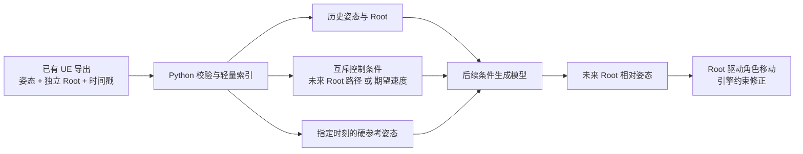

# Root 驱动与硬参考姿态：数据契约和基线 v1

## 本阶段结论

现有 `pose_only_root_authoritative` 数据继续作为来源：身体姿态处于 Root 相对空间，独立 Root 轨道负责移动。新增的条件任务只建立索引，不覆盖旧训练张量、统计量或检查点。当前可直接从 E 盘已经导出的 NPZ 离线完成校验、取窗、接触标签、统计量和基线评估；整个过程无需启动 UE。



这里的“硬参考”是明确的未来时间点与全身骨骼姿态，输入中只有被选中的帧可见。未选择的未来姿态只能作为监督目标。以后可扩展为局部骨骼遮罩和外部用户姿态，但 v1 的生成器不会凭空获得这些条件。

## 数据来源与处理

| 阶段 | 输入 | 当前实现与边界 |
| --- | --- | --- |
| 新资产采样/重定向 | UE 动画资产或异骨架原始动作 | 仍需 UE 的资产系统；优先用现有 `UnrealEditor-Cmd` 批处理，进程仍会加载引擎和编辑器模块，资源开销并非零。当前未为此契约新增或验证命令行导出。 |
| 已导出数据整理 | `dataset.json`、`skeleton.json`、逐动作 `raw_*.npz` | 纯 Python 逐段读取并校验哈希、维度、真实帧、30 FPS 时间轴、独立 Root 四元数。 |
| 条件样本 | 真实帧中的 24 帧历史、24 帧未来，步长 4 | 只写 `windows.jsonl` 轻量索引；不复制一套动作数组，也不从补齐帧取窗口。 |
| 标签与归一化 | 原始姿态和 Root | 用真实 Root 与姿态派生四个脚部接触启发式标签；姿态与 Root 速度统计量只遍历训练分区的真实帧，每段只计一次。 |
| 基线/诊断 | 留出集、明确的 Root 与硬参考条件 | 用 Python 评估，不调用 UE 或训练模型。最终蒙皮、IK、碰撞、网络移动和场景落点仍需 UE 中验收。 |

已实现入口：`data/tools/build_conditioned_motion_index.py`、`data/runtime/conditioned_motion.py`、`training/evaluation/evaluate_conditioned_baselines.py`。来源文件继续位于 `E:\AIAnimationSystemData\prepared\native30_traversal_semantic_v1`；新索引位于 `E:\AIAnimationSystemData\prepared\reference_guided_root_pose_v1_20260924`。索引目录仅含契约、窗口行和统计量，不是第二份训练数据。路径存在于契约中，迁移来源目录后需要重新建立索引。

2026-09-24 质量审计后，后续条件生成实验应使用 `E:\AIAnimationSystemData\prepared\reference_guided_root_pose_v1_20260924_audited`。它仍引用同一套原始动作，只在条件索引中屏蔽了 3 条精确重复的训练片段；旧索引作为审计前基线保留。完整发现和复核范围见下文。

新动作的省资源路线是先在 Python 中做清单去重、骨架头分类、切段和格式检查，再把确实需要资产级重定向/导出的动作交给已有无界面 UE 批流程；同骨架的小批动作共用一次 UE 进程，并维持单实例与磁盘余量门禁。`UnrealEditor-Cmd` 仍会加载 UE 模块，不能视为纯 Python；完整编辑器只为少量蒙皮、落脚、抓握和场景碰撞的视觉复核打开。本轮没有运行或改写 UE 批流程。

## 逐窗口契约

- 坐标：来源骨架声明为 UE 厘米系，实际 NPZ 数组已经转换到 Motion 米制 Y 向上空间（Motion `x=-UE y`、`y=UE z`、`z=UE x`）；姿态位置为 Root 相对坐标，Root 控制路径以最后一帧历史 Root 为原点，四元数次序为 `x,y,z,w`。时间以 30 FPS 整数帧对齐。
- 可见历史：`history_pose [24,79,3]`、`history_rotations [24,79,3,3]`、`history_root_local [24,7]`。
- 控制二选一：`future_root_plan_local [24,7]` 表示权威 Root 路径；或 `mean_desired_velocity [3]` 表示未来窗口的局部水平 `x,z` 速度和偏航角速度。速度模式不同时暴露完整未来 Root。当前两个条件都由真实动作反推，仅用于离线理想条件试验；真实游戏要由 CMC/Mover、运动匹配式 Root 规划或玩家输入提供。
- 硬参考：`reference_frame_mask [24]`、`reference_bone_mask [24,79]`、`reference_pose [24,79,3]`、`reference_rotations [24,79,3,3]`。v1 对指定帧暴露全身骨骼，非参考帧的条件数组置零；参考时刻按未来窗口的零基帧偏移指定。训练时可随机抽取参考时刻，评估时固定场景与随机种子。
- 仅监督：`future_pose`、`future_rotations`、`future_root_track`、`future_contacts`。不能把目标姿态或接触标签作为输入；`future_root_track` 是速度条件试验和评估恢复世界脚速所需目标，路径模式仅通过相对 Root 路径暴露相应控制量。
- 当前不可用：场景几何、障碍物轮廓、可落脚区域、手部目标与真实玩家轨迹。接触只是从脚速和高度派生的标签，不等同于物理接触真值。

数据契约通过来源清单哈希、训练签名、骨架哈希、每段原始 NPZ 哈希及统计文件哈希绑定。`contract.json` 写在索引建立的最后一步；若中途失败且没有契约文件，该目录不能使用。来源分区直接继承现有语义划分；Traversal 动作家族已按来源规则分组，但其他类别的相似变体可能跨分区，因此留出集数字不能宣称完全独立泛化。

## 当前数据审计

2026-09-24 在 E 盘现有数据上完成一次构建：来源共 1,722 段，训练/验证/测试分别为 1,340/198/184 段；初始索引得到 34,751 个真实帧窗口，分别为 26,879/4,052/3,820。53 段不足 48 个真实帧，保留为姿态素材但不进入此生成窗口。统计量没有使用旧数据集的末帧补齐部分。以上为实测数量，不代表新增采集或新的模型训练。

### 全量离线质量审计与筛选

`data/tools/audit_conditioned_dataset.py` 逐段核验来源哈希、维度、时间轴、Root/姿态连续性、旋转矩阵、实体骨段长度、脚接触标签复算及精确动作跨分区重复。它只写报告，不改资产和分区。全部 1,722 段通过完整性与接触标签复算，没有骨段长度或旋转矩阵超出本次宽松阈值的片段。

发现两组完全相同的姿态与 Root 数组分别跨越训练/测试、训练/验证：Jump 的 `Off` 与 `Start` 不同资产名。另有一组训练内部精确重复。审计版条件索引屏蔽训练侧清单索引 `620`、`660`、`672`，并从训练统计量中移除相应真实帧；来源 NPZ 保留。审计版有效训练片段为 1,337 段，训练/验证/测试窗口为 **26,861/4,052/3,820**，总计 **34,733**。再次审计后，实际启用片段之间的精确数组跨分区重复为 0；留出集保持原样。

运动阈值筛选得到 **95 段复核候选**：Root 瞬时速度超过 15 m/s 的 78 段、Root 高度跨度超过 10 m 的 50 段、骨盆世界速度超过 20 m/s 的 32 段，以及普通 Run/Walk 没有派生脚接触的 3 段，类别与阈值有重叠。95 段中 Jump 58、Traversal 34、Run 2、Walk 1。另按每个未标记类别抽取代表片段，复核队列共 107 段。阈值本身不能判定高位移是正常跳跃、下落、攀越还是错误；人工结论与批量标记的范围见下方封版记录，未自动剔除这些片段。47 段无派生脚接触，其中大多数属于 Jump/Traversal/Slide，单凭标签为零不能判坏动作。13 组跨分区 Root 轨道完全相同，但姿态并非精确重复；这可能是共享控制曲线，仍需单独复核语义近似泄漏。

复现与查看：

```powershell
& .venv\Scripts\python.exe -m data.tools.audit_conditioned_dataset `
  --contract 'E:\AIAnimationSystemData\prepared\reference_guided_root_pose_v1_20260924_audited' `
  --output 'output\conditioned_data_audit_20260924_complete'
```

当前报告包括 `report.json`、逐段 `clips.csv` 和 `review_queue.json`。新输出目录必须尚不存在。

人工复核沿用项目已有的 `motion_review_server.py` 与 `review_web`，使用同一骨架播放器和 SQLite 结论库。prepared 模式读取固定的审计队列，按每页最多 50 条展示；来源 NPZ 经哈希验证，只读加载并合成 Root 轨迹。无需打开完整 UE 编辑器。

```powershell
& .venv\Scripts\python.exe -m data.tools.motion_review_server `
  --library 'D:\MotionDataLibrary' `
  --conditioned-contract 'E:\AIAnimationSystemData\prepared\reference_guided_root_pose_v1_20260924_audited' `
  --conditioned-audit 'output\conditioned_data_audit_20260924_complete'
```

浏览器访问 `http://127.0.0.1:8765/`。人工结论保存到 `D:\MotionDataLibrary\reviews\decisions.sqlite3`，导出功能生成含队列与结论的 JSON。prepared 模式默认展示世界位移和三维 Root 轨迹，`F` 聚焦当前角色，右键加 WASD/QE 可按 UE 习惯移动相机；“姿态跟随”可单独切换。此处展示的是 Root 合成骨架；蒙皮、碰撞、脚接触和场景落点仍需后续 UE 验收。

## 非学习基线

测试集每段选一个中心有效窗口，实际有 176 段可评估。主要指标是**非参考帧的关节位置 RMSE**，先对每段求平均，再按片段等权汇总；还记录参考帧误差、旋转误差、姿态速度误差和接触时世界脚速。两种方法均将明确给出的参考帧精确投影回输出。

| 条件/方法 | 非参考帧位置 RMSE | 解释 |
| --- | ---: | --- |
| 无参考，保持最后历史姿态 | 23.89 cm | 最简单的时间保持基线。 |
| 中间与末尾两帧参考，线性插值 | 11.55 cm | 参考帧提供明显信息；插值结果仍可能违反骨长和接触约束。 |

这些数值均使用**原动作未来 Root 轨道作为理想控制输入**，Root 路径误差按条件定义为零，绝不是 Root 规划器或新生成模型的成绩。`Candidate24` 的已知动作重建也不属于同一个输入任务，不能直接比较数值。审计版索引重评估后，测试指标未变，因为没有更改测试片段。最终报告包含四种参考场景、两种方法、逐片段及分类聚合；两帧参考插值的接触脚速约 1.13 m/s，而原动作同一接触帧约 0.049 m/s，说明简单插值远未解决脚部约束。这些是启发式接触标签下的诊断量。

复现命令（项目根目录执行，输出目录必须不存在）：

```powershell
& .venv\Scripts\python.exe -m data.tools.build_conditioned_motion_index `
  --source 'E:\AIAnimationSystemData\prepared\native30_traversal_semantic_v1' `
  --output 'E:\AIAnimationSystemData\prepared\reference_guided_root_pose_v1_20260924_audited' `
  --history-frames 24 --future-frames 24 --stride-frames 4 `
  --exclude-train-indices 620 660 672

& .venv\Scripts\python.exe -m training.evaluation.evaluate_conditioned_baselines `
  --contract 'E:\AIAnimationSystemData\prepared\reference_guided_root_pose_v1_20260924_audited' `
  --output 'output\conditioned_baselines_20260924_audited' --split test --per-clip 1
```

## 2026-09-24 数据封版

验收后版本固定为 `reference_guided_root_pose_v1_20260924`。封版目录在 `E:\AIAnimationSystemData\freezes\reference_guided_root_pose_v1_20260924`，仓库中的 `data/freezes/reference_guided_root_pose_v1_20260924.json` 保存同一份哈希锁。目录内复制轻量契约、窗口索引、统计量、全量审计、测试基线与 107 条验收结论；原始 1,722 条 NPZ 留在原 E 盘目录，由契约中的逐条哈希绑定。再次全量审计的报告、复核队列和逐条 CSV 与首次审计逐字节一致。当前有效窗口为训练 26,861、验证 4,052、测试 3,820；训练侧排除索引 620、660、672。

107 条固定复核队列均记录为 `approved`，其中 95 条异常候选、12 条分类抽样；58 条备注保留批量标记。结论只覆盖该队列，批量标记不证明逐条观看，也不代表全部 1,722 条已逐条视觉验收。线框验收的蒙皮、IK、碰撞与场景落点边界仍适用。封版不代表已获准训练；等用户明确指示后，再从此版本开始训练实验。

封版工具为 `data/tools/freeze_conditioned_dataset.py`，要求审计无完整性错误、有效分区无精确动作交叉、测试基线匹配契约、每页名单与 SQLite 结论一致且全部通过，并核对统计量和窗口数量。封版输出目录与锁文件都必须尚不存在；若来源或验收结论发生变化，应建立新版本，不能覆盖此版本。

## 下一步的先后顺序

1. 沿用已固定的数据契约与测试集；对后续发现的动作类型、Root/姿态连续性、脚接触误标和短片段问题建立下一版 QA 记录。可用轻量骨架查看器处理大多数样本，UE 只用于资产语义或最终蒙皮验收。
2. 补采真实控制条件：游戏内 CMC/Mover/Root 规划的期望轨迹或速度，以及场景几何、落点、接触目标。必须保留“原动作 Root 理想条件”和“真实游戏控制条件”两套独立评估。
3. 再确定训练样本策略与模型接口：历史 + 单一控制模式 + 稀疏硬参考 → Root 相对未来姿态；损失包含非参考帧姿态、时序、接触与参考一致性。保持 Root/角色位移的单一权威来源。
4. 用户明确开始训练后，先小样本过拟合与验证集检查，再正式训练；最后通过无界面 UE 批验证、少量完整编辑器视觉验收及运行时性能测量。
