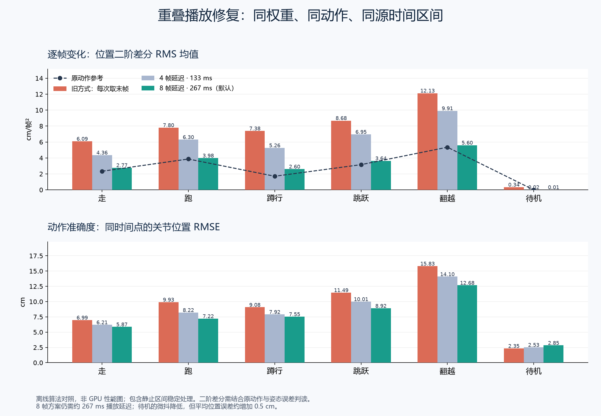
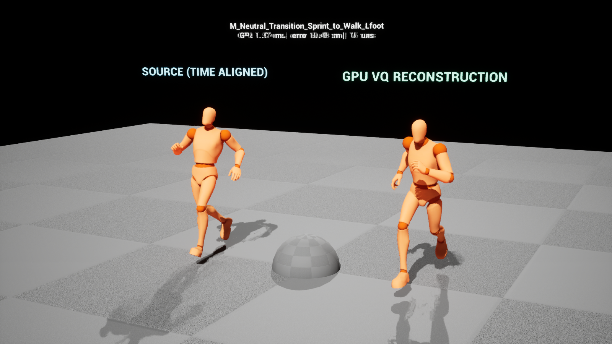
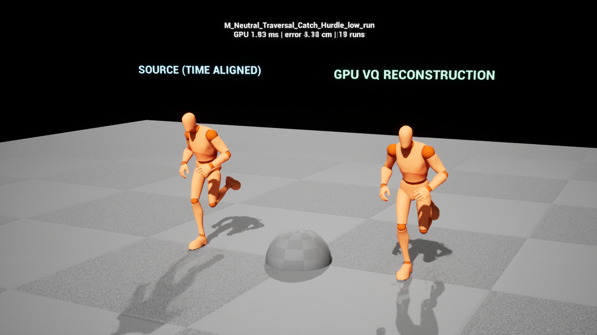

# AI Animation Inference Lab

## UE 编辑器预览工作台（2026-09-23）

推荐从仓库根目录运行 `./unreal-script/AIAnimation/Run-PreviewWorkbench.ps1`：它打开独立的 AIAnimation 窗口，隐藏原编辑器主窗口，跳过上次打开的关卡和启动资产，并将帧率限制为 30 FPS（可用 `-MaxFPS` 调整）。独立窗口仍依赖 UnrealEditor 进程和编辑器资产系统；节省的是关卡加载与隐藏视口的开销，不等同于轻量运行时程序。关闭独立窗口会退出该编辑器进程。也可在 GASP 项目的普通编辑器菜单 **工具 → AIAnimation 预览工作台** 打开停靠版本，或在控制台执行 `AIAnimation.OpenWorkbench`。

工作台默认加载低障碍翻越动画与 Candidate24 模型，动画和模型均可用资产选择器切换。视口沿用 UE 编辑器相机操作，三路依次显示同时间点的源动画、GPU 软输出、GPU 加硬参考结果；底部支持播放、暂停、逐帧和时间轴定位。拖动滑块时三路画面随滑块实时定位，内部会补齐模型历史；松开后仍保持暂停。逐帧也保持暂停；靠近片尾时，最大可到达姿态仍受推理延迟限制。

播放区显示源动画的 30 Hz 采样帧数，可设置源帧起止点并启用区间循环。倍速可直接输入，或选 0.25/0.5/0.75/1/1.25/1.5/1.75/2 倍预设；“输出 FPS”独立设置每秒希望显示的帧数，不修改倍速，反过来也一样。预计播放秒数 = 区间源帧数 ÷ 30 ÷ 倍速；预计显示总帧数 = 播放秒数 × 输出 FPS。例如 30 个源帧、0.5 倍速、60 输出 FPS 会播放约 2 秒、显示约 120 帧。工作台将刷新上限调到所选输出 FPS；实际能否达到仍受显示器刷新率、GPU 推理与机器负载限制。工作台实时预览、跳帧与录制统一从动画起点沿 30 Hz 网格推进，倍速与输出 FPS 只控制从该网格选择显示帧；高于 30 FPS 或慢放会重复相邻源采样帧。向后跳转会重新推理前序历史，长动画拖动可能耗时。片尾继续补齐延迟所需的采样，不循环混入片头。这里不会向原 `AnimSequence` 写入新关键帧或生成导出资产。上一帧、下一帧按一个输出帧间隔定位。

右侧可以将当前源动画帧加入硬姿态参考、删除参考、撤销或重做尚未保存的修改，并保存为每动画独立的 `UAIAnimationReferenceSet` 资产。资产存放在当前 UE 项目的 `/Game/AIAnimationPreview/References/`，记录动画软引用与 30 Hz 源帧号；运行时从该动画对应帧读取局部姿态，原 `AnimSequence` 不被修改。低障碍翻越动画在首次打开且尚无资产时显示 32/34/44/52/56/59 六个未保存的实验参考；保存后以后均以资产为准。实验参考只支持源帧姿态，尚不支持逐骨骼手工雕刻。

“应用根运动”只改变编辑器预览场景：统一采样源动画 Root 轨迹并移动三路 Mesh。可独立开关 Root 轨迹与骨骼名称；轨迹标记起点、当前点和终点，右侧显示 Root 位移、水平位移、速度、轨迹总长及朝向。骨骼名称默认标注硬参考角色，可切换到源动画或软输出；视口自动避让重叠文字，放大视口会显示更多，也可搜索骨骼名或勾选“显示全部”。模型仍负责身体相对姿态；关闭根运动时三路角色固定在原地。编辑器面板、资产操作与预览场景在 `AIAnimationEditor`，推理节点及数据类型在 `AIAnimation`。现有命令行对照台继续供批量测量使用。界面数值来自实际动画任务的最近采样，不代表已完成完整玩法或打包验证。

**定位：模型效果与性能实验插件。正式游戏运行时、业务工具函数及完整动画系统将在后续独立设计和开发。**

2026-09-22 新增 [24 帧稀疏条件候选实验](docs/candidate24-evaluation.md)：170 条可比留出片段中 164 条位置误差改善，UE 数值校验和运行验收通过。使用 `Run-GaspPreview.ps1 -Variant Candidate24 -Mode Interactive` 查看；旧默认入口保留。该方案尚未解决全部 Traversal 偏差和抽搐，未采用直接骨盆纠正或末端外推。

UE 模块声明中的 `Runtime` 只表示实验场景在游戏进程内需要加载它，不代表具备生产可用性。插件在编辑器中标记 Experimental，默认不启用。

## 已验证的实验链路

GASP 动画序列 → 79 骨骼的 Root 相对姿态 → 30 Hz、16 帧历史窗口 → 固定 4 帧步长的动画线程 DirectML 推理 → 按时间戳融合尚未播放的局部姿态 → 延迟 8 帧的播放缓冲 → 渲染帧间位置/四元数插值 → 身体姿态写回。模型外的辅助骨骼读取相同时间点的完整源姿态；运行时 Root 保持当前源动画权威，工作台的三路 Root 则统一固定或显示同一轨迹。

模型为 `training/runs/relative_v2_vqvae_contract_20260909/checkpoints/final.ckpt`，20,000 步、Schema v2、`pose_only_root_authoritative`。当前实验需要原动画作为输入，并未实现由玩家意图生成动作。对照台固定 Root 以避免角色移出镜头；它不验证 CMC/Mover 的实际位移。

六类留出集动作：Walk、Run、Crouch、Jump、Traversal、Idle。每类播放 6 秒，前 2 秒不纳入稳态统计。左侧按与右侧相同的时间点读取源姿态，只复制模型骨架契约，不创建 GPU 实例。左右角色仍固定 Root。

默认 `AIAnimation.Streaming=1`、`AIAnimation.DelayFrames=8`：固定步长每 4 个输入采样帧推理一次，理论频率 7.5 Hz，播放延迟约 267 ms。窗口按绝对采样编号对齐，中心权重较高；已经播放或用作插值端点的预测被冻结。局部空间位置与四元数融合，保持骨骼层级。低帧率补齐输入采样点，跨过多个推理边界时按顺序处理。

源骨架所有局部变换连续 6 个采样间隔几乎不变时（平移差每轴不超过 0.01 cm、旋转差小于 0.001 rad），锁定该静止区间的预测，抑制解码器不同时间位置的周期性微抖。源动作恢复后用 4 个采样点解除锁定。该规则适用于当前已知源动画的重建实验，不是条件生成模型的通用策略。

回绕、切换或长间隔重置窗口，旧窗口不参与新段融合。重置清空上一段显示姿态与模型历史；模型预热完成后从延迟源姿态过渡到模型约 150 ms。统计只采集模型完全接管后的同时间点姿态，位置二阶差分使用连续 30 Hz 样本；预热、过渡或时间不连续的差分不计入。

`AIAnimation.Streaming=0` 保留逐采样取末帧、无延迟、保持输出的旧方式，便于 A/B。模型与骨架失败、Game Thread 求值均回退源姿态并计数。验收要求每动作至少 20 个质量样本、5 个推理样本，且失败、回退、线程跳过均为零；通过只说明链路有效，不是动作质量达标。

## 2026-09-22 首轮实测（CR 修复前，历史记录）

环境：Windows、UE 5.8.2、RTX 4070 Laptop GPU、1600×900 窗口、关闭 VSync。独立游戏进程内渲染两个角色，其中一个做模型重建；不是打包后的 Shipping 测试。

| 指标 | 平均 | P95 |
| --- | ---: | ---: |
| 同步推理墙钟耗时 | 6.11 ms | 8.75 ms |
| 重建节点求值耗时，不含源图 | 6.20 ms | 8.84 ms |
| 相对原动作的 79 骨骼位置 RMSE | 9.71 cm | 21.45 cm |
| 重建阶段整体帧间隔 | 6.41 ms | 9.82 ms |

593 次稳态推理采样，推理失败 0，Game Thread 跳过 0。报告记录的工作线程 ID 均不同于 Game Thread。同步推理耗时包含 CPU 调度、上传、GPU 执行及下载等待，**不是纯 GPU kernel 时间**。DirectML 后端可把少量辅助算子分配给 CPU，本实验没有实现 CPU 推理优化路线。

初始短暂关闭重建阶段存在加载/预热尖峰，且只覆盖第一个动作，因此不能用该阶段与后续六类动作比较来声称加速或计算准确的额外帧开销。没有测试多人并发、长时运行、打包或移动设备。

导出时与原始训练实现、ONNX CPU 数值路径分别对照；UE 内 DirectML 对 6 组输入独立验证，最大混合输出元素绝对差 0.000671387，小于 0.01 门限。位置单位 cm，旋转矩阵元素无单位，因此该数值不能解读为整体姿态误差。

结果保存在仓库的 `output/ai_animation_runtime_v2/`，包括 `runtime_report.json` 和六张 `clip_00.png` 至 `clip_05.png`。导出及 GPU 校验在 `output/ue_animgraph_v2/`。原始运行日志与 Insights trace 在 `.build/ai_animation_runtime_v2.*`。

画面可正常显示重建骨架，但重建存在显著姿态偏差。当前结果只证明实验链路跑通，不代表达到 GASP 原版效果。默认 GASP 地图的额外接入尝试遇到原项目 Widget 的非编辑器编译错误，未完成真实玩法验证；本实验的可重复入口限定在独立对照场景。

## 首次 CR 修复后复测（重叠播放前，历史记录）

本轮修复固定 30 Hz 插值采样、源动画回绕清空窗口，以及逐动作验收。每个动作至少需要 20 个有效推理样本，且推理失败、模型/骨架回退、Game Thread 跳过都为零；报告列出每动作的样本量、回绕次数、误差和耗时。回绕后的预热输出源姿态，这段不作为模型重建样本。

| 同一机器、同一模型 | 不限帧率 | 限制 20 FPS |
| --- | ---: | ---: |
| 六类动作逐项通过 | 6/6 | 6/6 |
| 有效推理采样 | 570 | 384 |
| 推理/回退/线程跳过异常 | 0/0/0 | 0/0/0 |
| 同步推理平均 / P95 | 6.07 / 10.45 ms | 2.76 / 2.87 ms |
| 关节位置 RMSE 平均 / P95 | 9.06 / 20.47 cm | 8.91 / 20.35 cm |

低帧率运行仍补齐 30 Hz 输入网格，但每个渲染帧最多推理一次；较低渲染负载下的等待时间不可与不限帧率结果当成算法加速对比。两轮均记录到每个动作 1 次回绕重置，Idle 2 次。正常帧率下，Idle/Walk/Run/Crouch/Jump/Traversal 的平均关节误差分别为 2.43/6.01/9.58/8.77/11.15/14.86 cm，复杂动作仍有明显偏差。

权重未改变。与修复前相比，统计剔除了跨回绕的污染窗口、输入采样时刻也改变，不能据此声称模型精度提升百分比或帧耗时优化。误差比较的是推理窗口最新采样点与模型输出，不是所有渲染帧的显示误差；推理之间仍保持上一输出。

复测报告与截图分别在 `output/ai_animation_runtime_fixed/`、`output/ai_animation_runtime_fixed_20fps/`。UE 编译通过；`AIAnimation.Lab.FixedSampling` 自动化测试通过，验证 20/45/60/144 FPS 下的实际共享采样函数产生等间隔时间网格，并验证缺样本、失败、回退和线程跳过不能通过逐动作门槛。自动化日志：`.build/ai_animation_sampling_tests.log`。

## 连续性修复最终复测（2026-09-22）

权重不变。相同机器、1600×900、60 FPS 上限、关闭 VSync，分别执行旧末帧、4 帧延迟、8 帧延迟三轮独立 UE GPU 测试。三轮六类动作均通过逐项链路门槛，推理失败、源姿态回退、Game Thread 跳过均为零。

| 播放方式 | 播放延迟 | 稳态推理样本数 | 同步推理平均 / P95 |
| --- | ---: | ---: | ---: |
| 旧末帧方式 | 0 ms | 583 | 1.99 / 2.54 ms |
| 重叠融合，4 帧延迟 | 约 133 ms | 152 | 2.33 / 2.95 ms |
| 重叠融合，8 帧延迟（默认） | 约 267 ms | 152 | 2.05 / 2.76 ms |

推理步长从 1 改为 4，理论频率由 30 Hz 降至 7.5 Hz；这不是 GPU kernel 加速四倍。上述计时包含同步传输和等待，不能与历史不限帧率测试直接比较。不同播放延迟的有效稳态区间不同，因此运行报告的整体姿态均值不用于精度改善百分比。

另用同一 ONNX 模型对相同源时间区间进行离线算法质量对照（CPU 数值路径，不测性能）：

| 动作 | 位置二阶差分 RMS，旧 → 默认（cm/帧²） | 骨骼位置 RMSE，旧 → 默认（cm） |
| --- | ---: | ---: |
| Walk | 6.09 → 2.77 | 6.99 → 5.87 |
| Run | 7.80 → 3.98 | 9.93 → 7.22 |
| Crouch | 7.38 → 2.60 | 9.08 → 7.55 |
| Jump | 8.68 → 3.64 | 11.49 → 8.92 |
| Traversal | 12.13 → 5.60 | 15.83 → 12.68 |
| Idle | 0.335 → 0.014 | 2.35 → 2.85 |

主要运动的二阶差分降低约 49%–65%，同时平均位置误差下降。二阶差分不是越低越好的独立质量目标，需结合源动作、速度误差及姿态误差判断。静止保护抑制了周期微抖，但 Idle 平均位置误差增加约 0.5 cm；Traversal 的旋转误差 P95 也未改善。4 帧方案仍出现更大的局部尖峰，因此默认选 8 帧。脚部速度误差仅是相对源动作的速度差，不等同于落地接触或真实滑步测量。

本轮重跑报告在 `output/ai_animation_runtime_cr_{lastframe,stream4,final}/runtime_report.json`；各目录含六类动作截图和运行日志。同时间区间对照与图表在 `output/ai_animation_runtime_overlap_comparison/quality_final.json`、`quality_comparison.png`。

最终 UE 编译通过；实际执行的 `AIAnimation.Lab.FixedSampling`、`AIAnimation.Lab.PlaybackBuffer`、`AIAnimation.Lab.StationaryPlayback` 三项自动化测试均成功，覆盖固定采样网格、同时间点插值、已播放端点冻结、四元数符号、缓冲上限、重置和静止解除。日志：`.build/ai_animation_stream_build_final.log`、`.build/ai_animation_stream_tests_final.log`。本轮没有重新训练模型，也未验证完整 GASP 玩法、打包、多角色并发或长时运行。

## 已提交的测试图表与画面

下图使用相同源时间区间对照旧末帧、4 帧延迟和默认 8 帧延迟。它用于判断算法输出的连续性和姿态误差；并非 UE GPU 性能图。



默认方案在 GASP 对照台的 Walk 与 Traversal 截图。左右角色读取相同的延迟源时间点，固定 Root 仅为镜头观察；截图不能证明完整游戏玩法或脚部接触质量。





## 重跑

当前机器已经将此插件关联至 `D:/GameAnimationSample/Plugins/AIAnimation` 并启用。先关闭使用该插件的 UE 进程。其他机器需要安装 GASP、把本目录放入项目 Plugins 并启用 AIAnimation 和 NNERuntimeORT。

```powershell
# 构建实验模块
& D:/UE_5.8/Engine/Build/BatchFiles/Build.bat UnrealEditor Win64 Development -Project=D:/GameAnimationSample/GameAnimationSample.uproject -WaitMutex -NoHotReloadFromIDE

# 已有生成资产时，直接跑约 41 秒对照测试并保存报告与截图
./unreal-script/AIAnimation/Run-GaspPreview.ps1

# 默认 8 帧延迟、60 FPS 的交互预览，手动关闭
./unreal-script/AIAnimation/Run-GaspPreview.ps1 -Mode Interactive

# 同条件测试 4 帧延迟与旧末帧方式
./unreal-script/AIAnimation/Run-GaspPreview.ps1 -DelayFrames 4
./unreal-script/AIAnimation/Run-GaspPreview.ps1 -Playback LastFrame

# 相同源时间区间的质量对照；CPU 只用于算法评估，不测 UE GPU 性能
.venv/Scripts/python.exe -m inference.profiling.evaluate_unreal_streaming --bundle output/ue_animgraph_v2 --dataset data/prepared/native30_relative_v2_worldcontacts --output output/ai_animation_runtime_overlap_comparison/quality_final.json
```

需要重新导出和导入时，从仓库根目录执行以下命令。Python 环境需要项目训练依赖、`onnx` 与 `onnxruntime`（或 Windows 的 `onnxruntime-directml`，二者不要同时安装）。导出输出目录必须不存在。

```powershell
.venv/Scripts/python.exe -m inference.export.export_unreal_animgraph --checkpoint training/runs/relative_v2_vqvae_contract_20260909/checkpoints/final.ckpt --output output/ue_animgraph_new
& D:/UE_5.8/Engine/Binaries/Win64/UnrealEditor-Cmd.exe D:/GameAnimationSample/GameAnimationSample.uproject -run=AIAnimationPrepare -ModelFolder=D:/AILocomotonSystem/GR00T-WholeBodyControl/output/ue_animgraph_new -ValidateGPU -unattended -nop4 -AllowCommandletRendering
```

导入命令只更新 `/Game/AIAnimationPreview/` 下的实验资产，包含模型、对照地图及一个插入重建节点的 GASP CMC AnimBP 副本。这个副本仅验证编译，未验证完整玩法，且节点在最终输出前，会影响原图的 IK 结果，不应作为正式接入模板。

## 实验代码边界

- `AIAnimationGpuSession`：每节点独立模型实例、固定缓冲及同步推理计时。
- `AnimNode_AIAnimation`：源姿态采样、骨架检查、历史窗口、求值和源姿态回退。
- `AIAnimationPoseBuffer`：按采样编号融合窗口、冻结播放端点、延迟插值和静止保护。
- `AIAnimationPreviewInstance` / `AIAnimationBenchmark`：测试图、对照角色、统计和截图。
- `AIAnimationPrepareCommandlet`：资产导入、GPU 数值校验和实验场景生成。

下一阶段继续用这个实验台分析按动作分类的质量、接触状态与延迟代价。游戏工具函数、模型服务生命周期、资源加载、LOD/预算、多人实例调度、动画切换与接触约束，均属于后续正式运行时工作的范围。

## 参考姿态后续实验（2026-09-23）

[Candidate24](docs/candidate24-evaluation.md) 为隔离导出与 UE 场景候选，默认导出仍是16帧无条件。后续增加了 [稀疏参考](docs/pose-reference-evaluation.md)、[姿态形状参考](docs/pose-shape-reference-evaluation.md)、[具体问题姿态](docs/targeted-pose-reference-evaluation.md) 等离线对照。

当前 [手选实验室](../../inference/profiling/pose-reference-lab.md) 允许用户亲自指定姿态，并比较模型软输出与最终融合后的硬约束。关键帧通过等式约束到位，不意味着模型预测精度达到零误差。它没有改动本插件推理节点、权重、Root 运动或游戏代理逻辑；UE 生产运行时、接触与过渡生成仍待实现。
